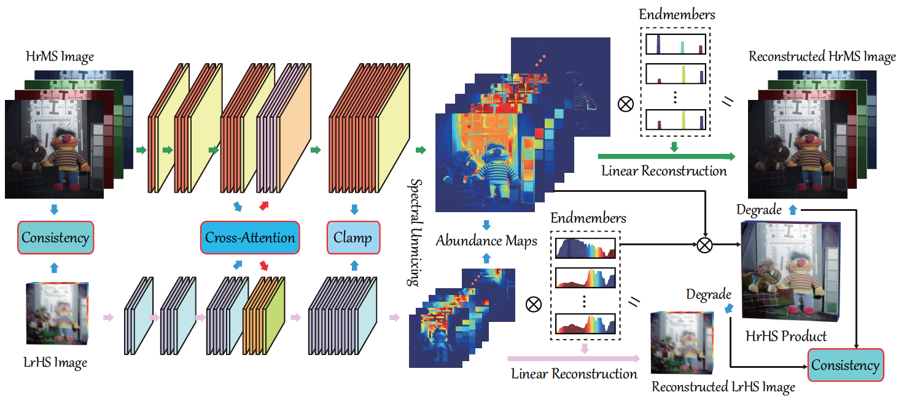

# Cross-Attention in Coupled Unmixing Nets for Unsupervised Hyperspectral Super-Resolution

[Jing Yao](https://scholar.google.com/citations?user=1SHd5ygAAAAJ&hl=en), [Danfeng Hong](https://sites.google.com/view/danfeng-hong), [Jocelyn Chanussot](https://scholar.google.com/citations?user=6owK2OQAAAAJ&hl=en), [Deyu Meng](https://scholar.google.com/citations?user=an6w-64AAAAJ&hl=en), [Xiaoxiang Zhu](https://scholar.google.com/citations?user=CNakdIgAAAAJ&hl=en), and [Zongben Xu](http://en.xjtu.edu.cn/info/1017/1632.htm)

___________

Code for the paper: [Cross-Attention in Coupled Unmixing Nets for Unsupervised Hyperspectral Super-Resolution](https://arxiv.org/pdf/2007.05230.pdf).



**Fig.1.** An illustration of the proposed unsupervised hyperspectral super-resolution networks, called Coupled Unmixing Nets with Cross-Attention **(CUCaNet)**, inspired by spectral unmixing techniques, which mainly consists of two important modules: cross-attention and spatial-spectral consistency.

## Training
Please simply run `./Main_CAVE.py` demo to reproduce our HSISR results on two HSIs (*fake and real food* and *chart and staffed toy*) of the [CAVE dataset](http://www.cs.columbia.edu/CAVE/databases/multispectral) (Using [PyTorch](https://pytorch.org/) with `Python 3.7` implemented on `Windows` OS).

- Before: For the required packages, please refer to detailed `.py` files.
- Parameters: The trade-off parameters as `train_opt.lambda_*` could be better tuned and the network hyperparameters are flexible.
- Results: Please see the five evaluation metrics (PSNR, SAM, ERGAS, SSIM, and UIQI) logged in `./checkpoints/CAVE_*name*/precision.txt` and the output `.mat` files saved in `./Results/CAVE/`.
- Runtime: ca. 1 hour per HSI using a single GTX2080.

:exclamation: You may need to manually download the two HSIs to your local in the folder under path `./Main_CAVE.py`, due to storage restriction, from the following links of google drive or baiduyun:

Google drive: https://drive.google.com/drive/folders/1eWQyObDkaFVJtslV0FalKBXr-HgcWdus?usp=sharing

Baiduyun: https://pan.baidu.com/s/1WIrOt4hVWoxS1o_H37_gCQ (access code: 6q6j)

## Testing
#TODO

## References
If you find this code helpful, please kindly cite:

[1] Yao, Jing, et al. "Cross-attention in coupled unmixing nets for unsupervised hyperspectral super-resolution." In *Proceedings of the European Conference on Computer Vision (ECCV)* (2020), pp. 208-224.

[2] Zheng, Ke, et al. "Coupled convolutional neural network with adaptive response function learning for unsupervised hyperspectral super-resolution." *IEEE Transactions on Geoscience and Remote Sensing* (2020), DOI: 10.1109/TGRS.2020.3006534.

## Citation Details

BibTeX entry:

```
@inproceedings{yao2020cross,
  title={Cross-Attention in Coupled Unmixing Nets for Unsupervised Hyperspectral Super-Resolution},
  author={Yao, Jing and Hong, Danfeng and Chanussot, Jocelyn and Meng, Deyu and Zhu, Xiaoxiang and Xu, Zongben},
  booktitle={European Conference on Computer Vision (ECCV)},
  pages={208-224},
  year={2020}
}
```

## Licensing

Copyright (C) 2020 Jing Yao and Danfeng Hong

This program is free software: you can redistribute it and/or modify it under the terms of the GNU General Public License as published by the Free Software Foundation, version 3 of the License.

This program is distributed in the hope that it will be useful, but WITHOUT ANY WARRANTY; without even the implied warranty of MERCHANTABILITY or FITNESS FOR A PARTICULAR PURPOSE. See the GNU General Public License for more details.

You should have received a copy of the GNU General Public License along with this program.

## Contact

If you encounter any bugs while using this code, please do not hesitate to contact us.

Jing Yao (:incoming_envelope: jasonyao92@gmail.com) is with the School of Mathematics and Statistics, Xi'an Jiaotong University, China;

Danfeng Hong (:incoming_envelope: hongdanfeng1989@gmail.com) is with the Remote Sensing Technology Institute (IMF), German Aerospace Center (DLR), Germany, and also with the Singnal Processing in Earth Oberservation (SiPEO), Technical University of Munich (TUM), Germany. 
